# General ML Review

Curated questions and answers for general Machine Learning Engineer interviews, covering ML theory, classic algorithms, deep learning and LLM basics, probability/statistics, from-scratch coding, ML system design, and production MLOps.

- **Total questions:** 89
- **Categories:** Foundations, Classic ML Algorithms, Deep Learning & LLMs, Coding & Implementation, Systems/MLOps/Design

---

## Foundations: ML Theory & Probability

### Explain the bias-variance tradeoff. How is it related to overfitting/underfitting, and what do you do if a model is high-variance vs high-bias?

- **Bias:** Error from simplifying assumptions; model cannot capture true patterns → underfitting
- **Variance:** Error from sensitivity to training data fluctuations; model learns noise → overfitting
- **Fixes for high variance** (overfitting): more training data, regularization (L1/L2), simpler model (fewer parameters), early stopping, dropout
- **Fixes for high bias** (underfitting): more features, larger/bigger model (more layers/trees), less regularization, train longer
- The tradeoff: increasing model complexity reduces bias but increases variance (and vice versa)

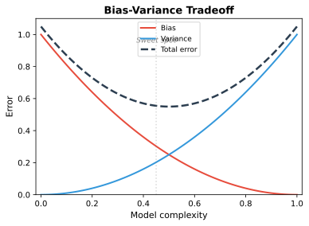

---

### What is overfitting and how can you prevent it? (Draw the loss curves for overfitting vs underfitting.)

- **Overfitting:** Model learns training data noise + patterns it shouldn't; training loss $\downarrow$ but validation loss $\uparrow$ (diverging curves)
- **Underfitting:** Model fails to learn patterns; both training and validation loss are high
- **Prevention:** regularization, dropout, early stopping, more training data, data augmentation, reduce model capacity
- Validation curves that diverge signal overfitting; parallel high loss signals underfitting

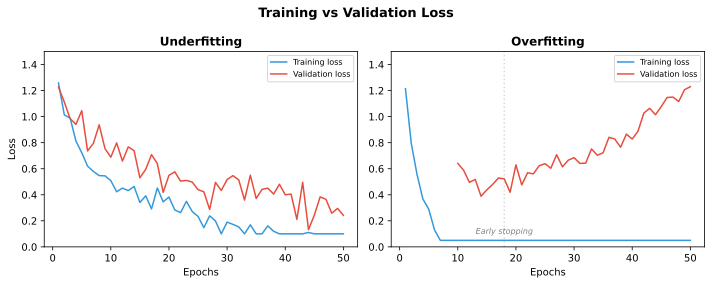

---

### What do L1 and L2 regularization mean, and when would you use each? When features are highly correlated, how do L1 vs L2 weights behave?

- **L1 (Lasso):** Penalizes absolute weight values → induces sparsity (some weights become exactly zero) → built-in feature selection
- **L2 (Ridge):** Penalizes squared weight values → shrinks all weights smoothly toward zero but never to exactly zero
- **With correlated features:** L1 arbitrarily picks one feature and zeros the others; L2 spreads weight across correlated features equally
- **Elastic Net:** Combines L1 + L2 to get sparsity while handling grouped features
- **When to use L1:** You expect sparse features or want interpretability
- **When to use L2:** All features are relevant, no sparsity needed

---

### Explain cross-validation and its importance. Why don't we see more cross-validation in deep learning?

- **k-fold CV:** Split data into k folds, train on k-1, validate on 1, repeat k times
- **Stratified CV:** Preserves class proportions in each fold
- **Importance:** More reliable estimate of generalization, less dependent on a single train/val split, especially important for small datasets
- **Why not in deep learning:** Training is computationally expensive; k-fold multiplies cost by k → impractical for large models. A fixed validation set is the practical default.

---

### Define precision, recall, and F1-score. When would you optimize for each?

- **Precision** $= \frac{TP}{TP + FP}$: Of predicted positives, how many were correct? Optimize when false positives are costly (spam detection, medical alerts)
- **Recall** $= \frac{TP}{TP + FN}$: Of actual positives, how many were caught? Optimize when false negatives are costly (disease screening, fraud detection)
- **F1-score** $= 2 \times \frac{P \times R}{P + R}$: Harmonic mean; balances precision and recall
- **When to optimize:** Focus on recall when missing a positive is bad; focus on precision when acting on a false positive is expensive; use F1 when both matter equally

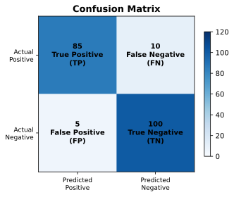

---

### What is the interpretation of ROC-AUC, and when would you use PR-AUC instead? Why can ROC-AUC be overly optimistic on imbalanced data?

- **ROC-AUC $=$ probability** that a randomly chosen positive is ranked above a randomly chosen negative
- **PR-AUC:** Plots precision vs recall; more informative when negatives heavily dominate (imbalanced data)
- **Why ROC-AUC is optimistic on imbalanced data:** The false positive rate (FPR) denominator $=$ total negatives; when negatives dominate, FPR stays low even with many false positives, giving a deceptively high AUC
- **Rule of thumb:** Use PR-AUC for imbalanced datasets, ROC-AUC for balanced ones

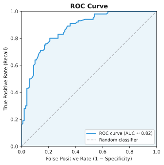

---

### Explain gradient descent. Compare batch, mini-batch, and stochastic gradient descent — which would you prefer and why?

- **Update rule:** $w = w - \eta \nabla L(w)$
- **Batch GD:** Uses entire dataset per step → accurate gradients, but slow and memory-heavy
- **Stochastic GD (SGD):** Uses one sample per step → fast updates, noisy gradients, can escape local minima but bounces around optimum
- **Mini-batch GD:** Uses a batch of $N$ samples → balances noise and accuracy, GPU-friendly, most practical default
- **Why mini-batch wins:** Vectorized computation on GPUs, lower variance than SGD, more efficient than full batch

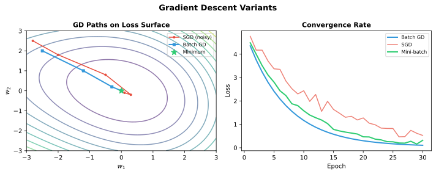

---

### Compare optimizers: how is Adam different from RMSprop and SGD? What can you say about their ability to converge and generalize?

- **SGD + momentum:** Simple, accumulates velocity in gradient direction; often generalizes best but requires careful LR tuning
- **RMSprop:** Adaptive per-parameter LR (divides by root mean square of recent gradients); handles sparse gradients well
- **Adam:** RMSprop + momentum + bias correction; fast convergence, works well out-of-the-box
- **Trade-off:** Adam converges faster but SGD+momentum can generalize better (finds flatter minima)
- **Rule of thumb:** Start with Adam for prototyping, switch to SGD+momentum with proper tuning for final deployment

---

### How do you handle an imbalanced dataset (oversampling/undersampling, SMOTE, threshold moving, metric choice)?

- **Resampling:** SMOTE (synthetic minority oversampling) vs random undersampling (risks losing data)
- **Algorithmic:** Class weights in loss function, focal loss for hard examples
- **Threshold moving:** Adjust decision threshold from 0.5 to optimize for precision/recall trade-off
- **Metrics:** Use PR-AUC, F1, recall at precision threshold — avoid accuracy
- **Data-level:** Collect more minority-class samples

---

### How do you handle missing or corrupted data? Name some imputation techniques.

- **Missingness types:** MCAR (missing completely at random), MAR (missing at random given observed), MNAR (missing not at random)
- **Imputation:** mean/median/mode, forward-fill (time series), KNN imputation, model-based (MICE, regression imputation)
- **Missingness indicators:** Add a binary flag column for whether a value was missing
- **Corrupted data:** Detect via z-score, IQR, domain validation; decide to drop, clip, or impute
- **Crucial:** Fit imputation on training set only to avoid data leakage

---

### When is feature scaling/normalization necessary and when is it not? Difference between normalization and standardization?

- **Standardization (z-score):** $z = \frac{x - \mu}{\sigma}$ → mean=0, std=1; doesn't bound values; robust to outliers
- **Normalization (min-max):** $x' = \frac{x - \min}{\max - \min}$ → scales to $[0,1]$; sensitive to outliers
- **Necessary for:** Distance-based models (KNN, SVM, k-means, PCA), gradient-based optimization (neural nets, linear/logistic regression)
- **Not necessary for:** Tree-based models (decision trees, random forests, gradient boosting) — splitting on a single feature is scale-invariant
- **Crucial:** Fit scaler on training data only, apply transform to val/test

---

### What is the curse of dimensionality, and how do you mitigate it?

- As dimensions increase, data becomes sparse; distances between points concentrate (all pairs become equally far apart)
- Required data grows exponentially with dimensions for the same density
- **Mitigations:** Feature selection (keep only informative features), dimensionality reduction (PCA, autoencoders), regularization, domain knowledge
- Nearest-neighbor methods and clustering break down in high dimensions

---

### What is feature engineering and feature selection? Describe filter, wrapper, and embedded methods.

- **Feature engineering:** Creating new features from raw data (polynomial features, date decomposition, domain-specific aggregates)
- **Feature selection** reduces dimensionality and overfitting:
  - **Filter:** Rank features by correlation, mutual information, chi-squared — fast, model-agnostic
  - **Wrapper:** RFE (recursive feature elimination), forward/backward selection — model-specific, expensive
  - **Embedded:** L1 regularization (Lasso), tree feature importance — selection happens during training

---

### What is the difference between one-hot encoding and label encoding, and when would you use each?

- **One-hot encoding:** Creates binary columns per category → no ordinal assumption; good for linear models, distance-based methods
- **Label encoding:** Assigns integer $0,1,2,\dots$ → implies ordering; can mislead linear models unless categories are naturally ordered
- **Ordinal encoding:** Label encoding for ordered categories (e.g., "small"=0, "medium"=1, "large"=2)
- **High-cardinality alternatives:** Hashing trick, target encoding, count encoding

---

### Can you use MSE to evaluate a classification problem instead of cross-entropy? Why or why not?

- **MSE + sigmoid** gives a non-convex optimization landscape with flat gradients where the sigmoid saturates → slow/poor convergence
- **Cross-entropy** loss aligns with maximum likelihood estimation; convex for logistic regression; strong gradients even when predictions are wrong
- Cross-entropy heavily penalizes confident wrong predictions; MSE treats all errors equally
- **Verdict:** Don't use MSE for classification — use cross-entropy (binary or categorical)

---

### Explain supervised, unsupervised, semi-supervised, weakly-supervised, and active learning with examples.

- **Supervised:** Labeled data → learn mapping (e.g., image classification with labeled photos)
- **Unsupervised:** No labels → find structure (e.g., customer segmentation via k-means)
- **Semi-supervised:** Small labeled + large unlabeled data → use unlabeled to inform decision boundaries (e.g., pseudo-labeling)
- **Weakly-supervised:** Noisy/incomplete labels → train despite label noise (e.g., using hashtags as image labels)
- **Active learning:** Model selects which data points to label next → maximize label efficiency (e.g., uncertainty sampling)

---

### What is the difference between a generative and a discriminative model?

- **Generative:** Models $P(x, y)$ or $P(x|y)P(y)$ → can generate new samples; e.g., Naive Bayes, GANs, diffusion models
- **Discriminative:** Models $P(y|x)$ directly → draws decision boundary; e.g., logistic regression, SVMs, neural networks
- **Trade-off:** Generative models use data more efficiently (can learn from fewer labels), discriminative models often have better accuracy given enough data
- **Practical rule:** Use generative if you need to sample from the distribution or have limited labels; use discriminative for pure prediction tasks with sufficient data

---

### How do you pick a suitable ML algorithm for a given problem?

- **Data size:** Small data → simple models (linear regression, Naive Bayes); large data → complex models (neural nets, gradient boosting)
- **Dimensionality:** High-dimensional → regularization (Lasso) or dimensionality reduction first
- **Interpretability needed:** Linear/logistic regression, decision trees, sparse models
- **Latency requirements:** Simple models for real-time; ensembles for batch
- **Data type:** Images → CNNs/ViTs; sequences → RNNs/Transformers; tabular → gradient boosting
- **Always start with a strong simple baseline** (linear model or simple decision tree) before trying complex models

---

### What is a p-value and how do you interpret it? Explain hypothesis testing (null/alternative, test statistic).

- **p-value** $= P(\text{observing data this extreme} \mid H_0 \text{ is true})$ — NOT the probability the null is true
- **Null hypothesis ($H_0$):** Default assumption (e.g., no effect, no difference)
- **Alternative hypothesis ($H_1$):** What you're trying to show
- **Test statistic:** A number computed from data ($t$-statistic, $\chi^2$, $F$-statistic) used to compute the p-value
- **Type I error:** Rejecting $H_0$ when true (false positive) — controlled by $\alpha$
- **Type II error:** Failing to reject $H_0$ when false (false negative)
- **Common misinterpretation:** $p > 0.05$ does NOT mean "no effect" — just insufficient evidence

---

### It's common to assume an unknown variable is normally distributed — why? Can PDF values be greater than 1?

- **Central Limit Theorem (CLT):** Sum/average of many independent variables tends toward normality regardless of underlying distribution → justifies normality assumption for aggregates
- **Maximum entropy:** Normal distribution has maximum entropy given mean and variance → least informative assumption
- **PDF $> 1$:** Yes! The PDF can exceed 1 for narrow distributions — only the integral (total probability $=$ area under curve) must equal 1
- Example: If a uniform distribution spans $[0, 0.1]$, the PDF value is 10 everywhere

---

### Given a fair coin, what is the expected number of flips to get two consecutive heads?

- Set up states: $E$ $=$ expected flips starting from scratch; $E_h$ $=$ expected flips after one head
- Equations:
  - $E = 1 + \frac{1}{2}E_h + \frac{1}{2}E \implies E = 2 + E_h$
  - $E_h = 1 + \frac{1}{2}(0) + \frac{1}{2}E \implies E_h = 1 + \frac{E}{2}$
- Solving: $E = 2 + 1 + \frac{E}{2} \implies \frac{E}{2} = 3 \implies E = 6$
- Generalization for $n$ consecutive heads: $E = 2(2^n - 1)$

---

### You call 3 friends to ask if it's raining in Seattle; each tells the truth with probability $\frac{2}{3}$ and all say yes. What's the probability it's actually raining?

- Apply Bayes' theorem: $P(\text{rain} \mid Y,Y,Y) = \frac{P(Y,Y,Y \mid \text{rain}) \, P(\text{rain})}{P(Y,Y,Y)}$
- Each friend: $P(\text{truth}) = \frac{2}{3}$, $P(\text{lie}) = \frac{1}{3}$
- $P(Y,Y,Y \mid \text{rain}) = (\frac{2}{3})^3 = \frac{8}{27}$
- Need a prior for $P(\text{rain})$. If we assume $P(\text{rain}) = P(\neg\text{rain}) = \frac{1}{2}$:
  - $P(Y,Y,Y) = \frac{1}{2} \cdot \frac{8}{27} + \frac{1}{2} \cdot (\frac{1}{3})^3 = \frac{4}{27} + \frac{1}{54} = \frac{1}{6}$
  - $P(\text{rain} \mid Y,Y,Y) = \frac{4/27}{1/6} = \frac{8}{9}$
- The result is sensitive to the prior — always state your assumption

---

### What are expected value, variance, and covariance? What does it mean for two variables to be independent?

- **Expected value** $E[X]$: Weighted average $\sum x \cdot P(X=x)$
- **Variance** $\text{Var}(X)$: $E[(X - \mu)^2] = E[X^2] - E[X]^2$ — spread of distribution
- **Covariance** $\text{Cov}(X,Y)$: $E[(X - \mu_x)(Y - \mu_y)]$ — direction of linear relationship
- **Independence:** $P(X,Y) = P(X)P(Y) \implies \text{Cov}(X,Y) = 0$, but the converse is NOT true (zero covariance does not imply independence)
- Covariance zero means no linear relationship; variables could still have nonlinear dependence

---

### What is maximum likelihood estimation, and how does it relate to loss functions?

- **MLE:** Find parameters $\theta$ that maximize $P(\text{data} \mid \theta)$
- Equivalently, minimize the **negative log-likelihood** (NLL)
- **Gaussian likelihood** $\implies$ MSE loss (L2) — assuming normally distributed errors
- **Bernoulli likelihood** $\implies$ binary cross-entropy loss — for binary classification
- **Categorical likelihood** $\implies$ categorical cross-entropy — for multi-class classification
- **MAP (maximum a posteriori):** MLE + a prior $\iff$ adding regularization (L2 $\iff$ Gaussian prior on weights)

---

## Classic ML Algorithms

### What are the assumptions of linear regression, and how do you check them?

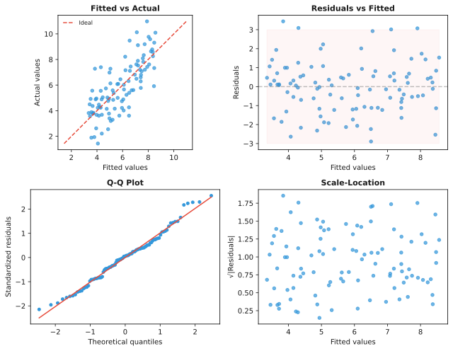

- **Linearity:** Relationship between $X$ and $y$ is linear — check with residual vs. fitted plot
- **Independence of errors:** Observations are independent — especially important for time series (Durbin-Watson test)
- **Homoscedasticity:** Constant variance of residuals — check residual vs. fitted plot (cone shape $=$ heteroscedasticity)
- **Normality of residuals:** Residuals are normally distributed — check with QQ plot (not critical for coefficient estimates, matters for confidence intervals)
- **No multicollinearity:** Predictors aren't highly correlated — check with VIF, VIF $> 5$–$10$ indicates a problem

---

### Explain the difference between linear and logistic regression. Can you derive gradient descent for logistic regression?

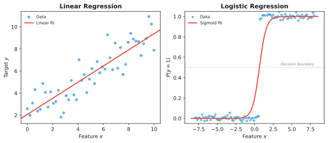

- **Linear regression:** Identity link; predicts continuous output; minimizes MSE (closed-form via normal equation or GD)
- **Logistic regression:** Sigmoid link $\sigma(Xw)$; predicts probability in $(0,1)$; minimizes log-loss (binary cross-entropy); convex optimization
- **Gradient for logistic regression:**
  - $L = -[y \log(\sigma) + (1-y) \log(1-\sigma)]$ where $\sigma = \sigma(Xw)$
  - $\frac{\partial L}{\partial w} = X^T(\sigma(Xw) - y)$ — same form as linear regression but with predicted probabilities
  - Update: $w = w - \eta X^T(\sigma(Xw) - y)$
- **Why log-loss is convex:** The Hessian is positive semi-definite → guaranteed global optimum

---

### What is the difference between random forests and decision trees? How does a random forest reduce variance?

- **Decision tree:** Single tree, low bias but high variance — overfits easily to training data

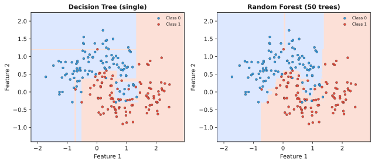

- **Random forest:** Ensemble of decision trees trained on bootstrapped samples with random feature subset per split
- **Variance reduction via:**
  1. **Bagging (bootstrap aggregation):** Average over models trained on different data subsets → reduces variance without increasing bias
  2. **Feature subsampling:** Decorrelates trees so averaging is more effective
- Result: RF has similar bias to a single tree but much lower variance → better generalization

---

### What is the difference between bagging and boosting? Compare random forest vs XGBoost.

- **Bagging:** Train models independently in parallel on bootstrapped samples; averages predictions → reduces variance
- **Boosting:** Train models sequentially, each correcting the previous model's errors (by fitting residuals or gradients) → reduces bias
- **Random Forest vs XGBoost:**
  - RF: Parallel, handles outliers well, fewer hyperparameters to tune, robust
  - XGBoost: Sequential, often better accuracy on structured data, handles missing values, built-in regularization, but more hyperparameter-sensitive
- **When each wins:** RF when data is noisy or you want a quick baseline; XGBoost when you want maximum performance on clean structured data

---

### Explain gradient boosting and its advantages over random forests. What does XGBoost add over vanilla gradient boosting?

- **Gradient boosting:** Sequential ensemble that fits each new tree to the negative gradient (residuals) of the loss function w.r.t. current predictions
- **Advantages over RF:** Can model complex non-linear patterns; often lower bias; better performance given enough tuning

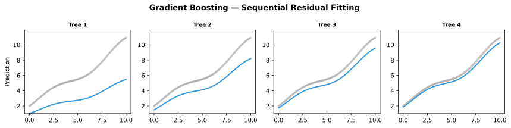

- **XGBoost adds:**
  - **Regularization** (L1/L2 on leaf weights) → prevents overfitting
  - **Second-order optimization** (Newton boosting) → approximates both gradient and Hessian for faster convergence
  - **Sparsity awareness** → handles missing values natively by learning optimal default direction
  - **Column block** → parallelized tree building
  - **Shrinkage** (learning rate) → slows down learning for better generalization
- **Risks vs RF:** More hyperparameters to tune, can overfit if not regularized, sequential training is slower

---

### Explain the support vector machine and the kernel trick. How do you generalize a 2-class SVM to multi-class?

- **SVM:** Finds the hyperplane that maximizes the margin between classes; only support vectors (points closest to boundary) matter
- **Kernel trick:** Implicitly map inputs to higher-dimensional space using a kernel function (RBF, polynomial) without computing the coordinates → enables non-linear decision boundaries
- **Multi-class:**
  - **One-vs-one (OvO):** Train $N(N-1)/2$ binary classifiers, majority vote
  - **One-vs-rest (OvR):** Train $N$ binary classifiers (one per class vs all others); pick class with highest confidence
- **Trade-offs:** OvO is more expensive (more classifiers) but more balanced; OvR can suffer from class imbalance

---

### Explain k-means clustering. How would you choose $k$, and how do you evaluate it if labels are known vs unknown?
- **k-means algorithm (Lloyd's):** Initialize $k$ centroids, assign each point to nearest centroid, recompute centroids as mean of assigned points, repeat until convergence

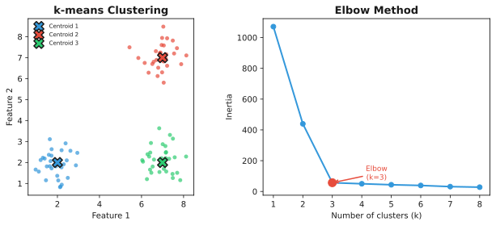

- **Choosing $k$:**
  - **Elbow method:** Plot inertia (within-cluster sum of squares) vs $k$, look for "elbow"
  - **Silhouette score:** Maximize average silhouette coefficient
  - **Gap statistic / BIC:** Statistical approaches
- **Evaluation with known labels:** Adjusted Rand Index (ARI), Normalized Mutual Information (NMI)
- **Evaluation without labels:** Silhouette score, Davies-Bouldin index, inertia (with caveats)

---

### How does KNN work? How do you choose $k$, and how does $k$ impact bias and variance?

- **KNN:** Classify/predict based on majority vote (classification) or average (regression) of $k$ nearest neighbors in feature space
- **Choosing $k$:** Cross-validation over a range of $k$ values
- **Impact of $k$:**
  - Small $k$ → high variance, low bias (decision boundary is very local, overfits)
  - Large $k$ → low variance, high bias (boundary is smooth, underfits)
  - $k=1$: Perfect on training, terrible on test (extreme variance)
  - $k=N$: Always predicts the majority class (extreme bias)
- **Important:** Scale features for KNN (distance-based)

---

### Explain PCA. What do eigenvalues/eigenvectors mean in PCA, and how does PCA differ from LDA?

- **PCA:** Finds orthogonal directions (principal components) that maximize variance in the data; eigendecomposition of covariance matrix
- **Eigenvectors $=$ directions** of principal components; **eigenvalues $=$ variance explained** by each component
- **Procedure:** Center data → compute covariance matrix → eigendecomposition → sort by eigenvalue → project onto top-$k$ eigenvectors

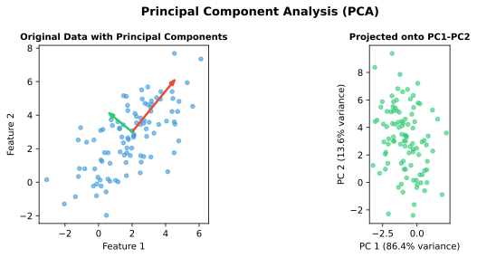

- **PCA vs LDA:**
  - PCA: Unsupervised, maximizes variance, no label information, good for compression
  - LDA: Supervised, maximizes class separability (ratio of between-class to within-class variance), limited to $C-1$ components ($C =$ number of classes)

---

### Why is the Naive Bayes classifier 'naive'? Give an example (e.g., tweet sentiment).

- **'Naive' assumption:** Features are conditionally independent given the class — almost never true in practice
- **Example (tweet sentiment):** $P(\text{positive} \mid \text{words}) \propto P(\text{positive}) \times \prod P(\text{word} \mid \text{positive})$ — treats each word as independent, ignoring grammar and context
- **Why it still works well:** Even with violated assumptions, the relative ordering of class probabilities is often preserved; works well for text classification, spam detection
- **Variants:** Gaussian NB (continuous), Multinomial NB (counts), Bernoulli NB (binary features)

---

### What are the different methods of dimensionality reduction (feature selection vs feature extraction)?

- **Feature selection:** Keeps a subset of original features → interpretable (e.g., filter methods, wrapper methods, L1 regularization)
- **Feature extraction:** Builds new features from original ones → not directly interpretable
  - **Linear:** PCA, LDA, Factor Analysis
  - **Non-linear:** t-SNE, UMAP, autoencoders, Isomap, LLE
- **When to use each:** Selection when interpretability matters; extraction when you want maximum compression or for visualization (t-SNE/UMAP)

---

## Deep Learning & LLMs

### What does backpropagation do in a neural network, and what are its drawbacks?

- **Backpropagation:** Efficient application of the chain rule to compute gradients of the loss w.r.t. all weights in the network (forward pass to compute loss, backward pass to propagate gradients layer by layer)

- **Drawbacks:**
  - **Vanishing/exploding gradients:** Gradients shrink/grow exponentially with depth
  - **Local minima / saddle points:** Non-convex optimization landscape
  - **Biologically implausible:** Requires symmetric backward connections and labeled data
  - **Memory intensive:** Must store activations from forward pass for gradient computation

---

### Explain the vanishing/exploding gradient problem. How do you detect and prevent it, and why are RNNs especially susceptible?

- **Problem:** In deep networks, repeated multiplication of gradients through many layers causes them to shrink (vanish) or grow (explode) exponentially
- **Detection:** Monitor gradient norms during training; if near zero or $\infty$, that's the sign
- **Prevention:**
  - Activation functions: ReLU (vs sigmoid/tanh which saturate)
  - Residual connections (skip connections)
  - Careful weight initialization (Xavier/Glorot for tanh, He for ReLU)
  - Gradient clipping (caps gradient norm)
  - Batch/Layer normalization
  - LSTM gates (for RNNs)
- **Why RNNs are especially susceptible:** The same weights are applied at every timestep; backpropagation through time (BPTT) multiplies the same weight matrix repeatedly → gradients either vanish or explode with sequence length

---

### Compare activation functions (sigmoid, softmax, tanh, ReLU, leaky ReLU). What is the dying ReLU problem?

- **Sigmoid:** $(0,1)$, smooth, saturates → vanishing gradient; output not zero-centered
- **Softmax:** Multi-class generalization of sigmoid; outputs probability distribution summing to 1
- **Tanh:** $(-1,1)$, zero-centered, saturates → vanishing gradient
- **ReLU:** $\max(0, x)$, non-saturating, cheap; sparse activations
  - **Dying ReLU:** Neurons can get stuck outputting 0 for all inputs (large negative bias) → never recover because gradient is 0
- **Leaky ReLU / Parametric ReLU:** Small positive slope for $x < 0$ (usually 0.01) → fixes dying ReLU

---

### Explain dropout and its role in neural networks.

- **During training:** Randomly zero out a fraction $p$ of activations in each layer (each neuron has probability $p$ of being dropped each forward pass)
- **Effect:** Prevents co-adaptation; acts as an ensemble of $2^n$ subnetworks (with weight sharing) → regularization
- **At test time:** All neurons active; multiply weights by $(1-p)$ to account for increased expected output (or use inverted dropout which scales during training)
- **Best for:** Large fully-connected layers with overfitting risk; less effective with batch norm

---

### How does batch normalization work and what are its benefits? Compare batch norm and layer norm.

- **BatchNorm:** Normalizes activations per batch dimension: $(x - \mu_\text{batch}) / \sigma_\text{batch}$; then applies learnable scale ($\gamma$) and shift ($\beta$)
- **Benefits:** Reduces internal covariate shift → faster convergence, smoother loss landscape, allows higher learning rates, provides slight regularization (due to noise from batch statistics)
- **BatchNorm vs LayerNorm:**
  - BatchNorm: Normalizes across batch (same feature across samples); depends on batch size; problematic for small batches or RNNs
  - LayerNorm: Normalizes across features (each sample independently); batch-size independent; preferred for transformers and RNNs

---

### Explain the architecture of a CNN. How do CNNs differ from traditional neural networks in processing images?

- **CNN components:** Convolutional layers (learn local feature detectors with shared weights), pooling layers (downsample, reduce spatial dims), fully-connected classifier head
- **Key differences from MLPs:**
  - **Local connectivity:** Each neuron sees only a local receptive field → captures spatial hierarchies
  - **Weight sharing:** Same filter applied across spatial positions → translation invariance, parameter efficiency
  - **Pooling:** Provides spatial downsampling and small translation invariance
- **Result:** CNNs have far fewer parameters than fully-connected networks for the same input size

---

### What are RNNs/LSTMs and how do they handle sequential data? How does an LSTM address vanishing gradients?

- **RNN:** Hidden state $h_t = f(W_h h_{t-1} + W_x x_t)$ passes context across timesteps; suffers from vanishing gradients over long sequences
- **LSTM:** Introduces a cell state $c_t$ (information highway) controlled by three gates:
  - **Forget gate:** What to discard from previous cell state
  - **Input gate:** What new info to add
  - **Output gate:** What to expose as hidden state
- **How LSTM addresses vanishing gradients:** The cell state has a constant gradient flow path (additive updates instead of multiplicative); gradients can flow back over many timesteps without vanishing
- **GRU:** Simplified variant with reset and update gates (fewer parameters than LSTM, similar performance)

---

### What is the transformer architecture and how does it work? Explain self-attention and multi-head attention (Q, K, V).

- **Transformer architecture:** Encoder-decoder (or encoder-only / decoder-only) with stacked blocks of self-attention + feed-forward + layer norm + residual connections
- **Self-attention (scaled dot-product):** $Q$, $K$, $V$ projections from input → $\text{Attention}(Q,K,V) = \text{softmax}\left(\frac{Q K^T}{\sqrt{d_k}}\right) V$
  - $Q$ (query): What am I looking for?; $K$ (key): What do I contain?; $V$ (value): What do I pass on?
  - Score $Q K^T$ measures pairwise similarity
  - Scaling by $\sqrt{d_k}$ prevents softmax saturation
- **Multi-head attention:** Run $h$ attention heads in parallel with different learned projections; concatenate results → model different relationship types
- **Positional encoding:** Sinusoidal functions or learned embeddings to encode position (since attention is permutation-invariant)
- **Why it works:** Can model all pairwise relationships in one layer, parallelizable (unlike RNNs)

---

### When building a neural network, should you overfit or underfit it first? Why don't we initialize all weights to zero?

- **Overfit a small batch first:** Verify the model has enough capacity to learn; if it can't overfit a single batch, there's a bug or capacity is too low
- **Then add regularization** to generalize
- **Why not initialize all weights to zero:**
  - **Symmetry breaking:** All neurons compute identical gradients → update identically → remain identical forever → no learning
  - **Xavier/Glorot init:** For tanh/sigmoid; scales weights as $\mathcal{U}\big[-\sqrt{\frac{6}{n_{in}+n_{out}}}, \sqrt{\frac{6}{n_{in}+n_{out}}}\big]$
  - **He init:** For ReLU; scales weights as $\mathcal{N}(0, \sqrt{\frac{2}{n_{in}}})$

---

### What is transfer learning and when would you use it? What are embeddings?

- **Transfer learning:** Take a model pretrained on a large dataset and adapt it to a downstream task
- **Approaches:**
  - **Feature extraction:** Freeze pretrained weights, train a new classifier on top
  - **Fine-tuning:** Unfreeze some/all layers and train with a small learning rate
- **When to use:** Limited labeled data for your task; the pretrained task is related to your task
- **Embeddings:** Dense, low-dimensional vector representations learned by a model (e.g., word2vec, BERT embeddings, image embeddings from CNNs)
- **Why embeddings work:** Similar items have similar vectors in the embedding space

---

### What is the difference between RAG and fine-tuning, and when would you use each?

- **RAG (Retrieval-Augmented Generation):** Retrieves relevant documents from an external knowledge base at inference time and injects them into the LLM's context; no weight changes
- **Fine-tuning:** Updates model weights on domain-specific data to bake behavior/knowledge into parameters
- **When to use RAG:** Frequently updated knowledge, access to proprietary documents, reducing hallucination on factual queries, cost-sensitive (one model serves many domains)
- **When to use fine-tuning:** Fixed behavior/style change needed (e.g., summarization format), teaching model a specific skill (e.g., code generation), offline deployment without retrieval infrastructure
- **Can combine both:** RAG for freshness, fine-tuning for tone/format

---

### What is tokenization and why is it critical for LLMs? Explain BPE / WordPiece.

- **Tokenization:** Converting raw text into subword or word units the model processes; critical because it defines the model's vocabulary and sequence length
- **Why it matters:** Good tokenization balances OOV (out-of-vocabulary) words vs sequence length; affects context window utilization and compute cost
- **BPE (Byte Pair Encoding):** Start with character vocabulary, iteratively merge the most frequent adjacent pair into a new token; widely used (GPT models)
- **WordPiece:** Similar to BPE but merges pairs that maximize likelihood of training data; used in BERT
- **SentencePiece / Unigram:** Language-model-based tokenization; doesn't require pre-tokenization (handles raw text, including spaces)

---

### Explain LoRA/QLoRA and other parameter-efficient fine-tuning methods. How would you reduce an LLM's compute cost (quantization, distillation, pruning)?

- **LoRA (Low-Rank Adaptation):** Freezes pretrained weights, injects trainable low-rank matrices into attention layers → fine-tune only ~0.1–1% of parameters
- **QLoRA:** Quantizes the pretrained model to 4-bit; adds LoRA adapters on top → fine-tune a 65B model on a single GPU
- **Other PEFT methods:** Adapters, prefix tuning, prompt tuning, (IA)$^3$
- **Compute reduction methods:**
  - **Quantization:** Reduce precision (FP16 → INT8/INT4); significant speed/memory gains, minor accuracy loss
  - **Knowledge distillation:** Train a smaller "student" model to mimic a larger "teacher" model
  - **Pruning:** Remove unimportant weights or attention heads; structured pruning (removes entire neurons/channels) is more hardware-friendly

---

## Coding & Implementation

> This section contains references to coding problems and DSA challenges recommended for ML interviews.

### Key areas to practice:

**ML from scratch (NumPy implementations):**
- Linear regression, logistic regression, k-means, KNN, k-fold cross-validation
- Neural network forward/backward pass
- Evaluation metrics (precision, recall, F1, confusion matrix)
- PCA, gradient descent variants

**Data Structures & Algorithms (LeetCode-style):**
- Arrays, strings, hash maps
- Trees and graphs
- Dynamic programming
- Complexity analysis (time and space)

### Analyze the time and space complexity of your solution.

- Always state big-O for both time and space
- Distinguish between amortized vs worst-case analysis
- Identify the dominant term and bottleneck
- Trade-offs: time vs space, preprocessing vs query cost

---

## Systems, MLOps & Design

### How do you frame an ambiguous business problem as an ML problem? What clarifying questions do you ask first (objective/metric, scale, latency, data availability)?

- Translate business goal to a well-defined ML target + metric (e.g., "increase revenue" → "predict purchase probability, optimize for expected revenue")
- **Clarifying questions:**
  - **Objective/metric:** What exactly are we optimizing? (accuracy, revenue, user engagement?)
  - **Scale:** How many predictions per second? Real-time or batch?
  - **Latency:** What's the response time budget? (100ms vs 10s)
  - **Data availability:** What data do we have? Labels? Historical logs?
  - **Constraints:** Interpretability requirements, regulatory concerns, infrastructure
- Define a baseline and success criteria before building
- Identify risks and potential failure modes early

---

### Design a recommendation system (e.g., product or music recommendations).

- **Two-stage architecture:** Candidate generation → ranking
- **Candidate generation:** Collaborative filtering (user-item interactions), content-based filtering (item features), two-tower retrieval model
- **Ranking:** Pointwise (CTR prediction), pairwise, listwise (LambdaRank); features: user, item, context
- **Cold start:** For new users → popularity-based fallback; for new items → content-based features
- **Offline metrics:** AUC, NDCG, recall@k
- **Online metrics:** CTR, engagement time, conversion rate
- **Challenges:** Diversity, freshness, filter bubbles, position bias

---

### Design a video recommendation system (e.g., YouTube 'recommend new videos').

- **Two-tower retrieval:** One tower for user features, one for video features; dot product produces candidate scores; use ANN (Approximate Nearest Neighbors) for fast retrieval from millions of videos
- **Ranking model:** Deep neural network with features from user watch history, video freshness, language, engagement signals
- **Objective:** Optimize for watch time (not just click-through) → weighted logistic regression
- **Serving:** $<200$ms latency budget; precompute embeddings, use feature store
- **Challenges:** Freshness (new videos daily), diversity, feedback loops

---

### Design a news feed / content ranking system (e.g., a social feed or Reels ranking).

- **Pipeline:** Candidate generation → lightweight ranking → heavy ranking → re-ranking (for diversity)
- **Features:** User engagement history, content embeddings, recency, relationship strength (social graph)
- **Engagement vs integrity trade-off:** Optimize for engagement but guard against toxic content (integrity model)
- **Metrics:** NDCG, precision/recall at k, calibration (predicted vs observed CTR)
- **Position bias:** Models learn that top positions get more clicks → use position as a feature at training, remove at inference

---

### Design an ad click-through-rate (CTR) prediction system.

- **Challenge:** Extreme class imbalance (~1–2% CTR); need well-calibrated probabilities
- **Model:** Large-scale sparse logistic regression or DNN with embedding layers for categorical features (user ID, ad ID, publisher ID) and dense features
- **Calibration:** Isotonic regression or Platt scaling to ensure predicted probabilities match observed rates
- **Low latency:** ~150ms serving budget; precomputed embeddings, model pruning; can use model parallelism
- **Online retraining:** Models are retrained daily or continuously (streaming) to capture changing user behavior
- **Metrics:** LogLoss, AUC, Normalized Cross-Entropy, Calibration plots
- **Challenges:** Data freshness, adversarial dynamics (advertisers adapt), budget constraints

---

### Design a fraud / anomaly detection system (e.g., for payments).

- **Extreme class imbalance:** ~0.1% fraudulent transactions; need high recall at acceptable precision
- **Features:** Transaction amount, location, device fingerprint, user history, velocity (time since last transaction)
- **Models:** Gradient boosting (XGBoost/LightGBM) + rules for high-precision blocks; can use autoencoders for unsupervised anomaly detection
- **Real-time inference:** Each transaction scored in $<100$ms; fallback to rule-based if model unavailable
- **Precision/recall trade-off:** Set threshold based on cost of false positive vs false negative
- **Challenges:** Adversarial evolution (fraudsters adapt), concept drift, feedback loops (blocking fraud changes future data distribution)
- **High availability:** System must be fault-tolerant; model downtime means accepting all or blocking all transactions

---

### Design a search / ranking system (e.g., e-commerce search ranking or autocomplete/type-ahead).

- **Retrieval stage:** BM25 for text matching + embedding-based retrieval (dual encoder with ANN) for semantic search
- **Ranking stage:** Learning-to-rank (LambdaMART, RankNet, ListNet) with features: text relevance, popularity, price, user history, click-through data
- **Query understanding:** Spell correction, query expansion, intent classification
- **Evaluation:** Offline (NDCG, MRR, recall@k) and online (CTR, conversion rate, revenue)
- **Type-ahead / autocomplete:** Trie-based prefix matching + rank by popularity/personalization; $<50$ms latency
- **Challenges:** Freshness, personalization vs diversity, position bias in click data

---

### Design an ETA prediction system for a maps application.

- **Data:** Historical travel times per road segment (time of day, day of week), real-time traffic, weather, incidents
- **Model:** Gradient boosting or RNN on segment-level features; predict travel time for each segment in the path
- **Prediction target:** Learn quantiles (p50, p90, p95) for different confidence levels
- **Serving:** Precomputed key-value store for typical routes; real-time model for live traffic
- **Train/validation split:** Time-based split; don't leak future data
- **Evaluation:** MAE, MAPE, pinball loss for quantiles

---

### Design a spam / abuse / harmful-content classifier (e.g., comment moderation or spam detection).

- **Classification levels:** Spam, toxic language, hate speech, misinformation; can be hierarchical or multi-label
- **Label sourcing:** User reports, human reviewers, active learning to prioritize ambiguous cases
- **Features:** Text embeddings (BERT/T5), user reputation, account age, posting frequency, link domains
- **Thresholds:** High precision (avoid false positives) with human review in the middle; recall sacrificed for user trust
- **Adversarial drift:** Spammers adapt to evade detection → require continuous retraining, adversarial training, robust features
- **Monitoring:** Track label distribution over time; detect when model needs retraining
- **System:** Real-time scoring with low latency; batch reprocessing for retraining

---

### Design an image classification / visual search service (e.g., visual search or landmark recognition).

- **Backbone:** CNN or Vision Transformer (ResNet, EfficientNet, ViT) pretrained on ImageNet
- **Visual search:** Use backbone as feature extractor; index embeddings in ANN database (FAISS, ScaNN)
- **Data augmentation:** Random crops, flips, color jitter, MixUp, CutMix
- **Evaluation:** Top-1/Top-5 accuracy, recall@k for retrieval
- **Serving:** Two-stage: (1) extract embedding via model, (2) ANN retrieval from billion-scale index; latency budget for both stages
- **Challenges:** Domain shift (user photos differ from training data), long-tail classes, freshness (new landmarks)

---

### Design an evaluation framework for a ranking/ads model (offline vs online metrics, A/B testing, guardrails).

- **Offline metrics:** AUC, NDCG, Recall@k, calibration error — useful for model selection but don't always correlate with business impact
- **Online metrics:** CTR, conversion rate, revenue, user retention — the true measure of success
- **A/B testing:** Randomize users, compare treatment model vs control; need statistical power (sample size calculation)
- **Guardrails:** Monitor counterfactual metrics (latency, coverage, fairness); if guardrail metrics degrade, auto-stop the experiment
- **Counterfactual / off-policy evaluation:** Estimate online impact from offline data — avoids expensive A/B tests, but requires overlap assumptions
- **Metric-model alignment:** Ensure offline metric correlates with online business metric; if AUC improves but revenue drops, revisit the metric

---

### What is training/serving skew? What causes it and how do you fix it (feature store, shared preprocessing)?

- **Training/serving skew:** Difference between model performance during training vs inference caused by inconsistent data processing
- **Common causes:**
  - Feature computation differs between train and serve (different libraries, missing values handled differently)
  - Data freshness: model trained on old distribution, serves on new
  - Leakage during training: using data not available at inference time
- **Fixes:**
  - **Feature store:** Single source of truth for feature definitions, computed once, used for both training and serving
  - **Shared preprocessing:** Same code path for train and serve (e.g., tf.transform, SageMaker Processing)
  - **Log predictions:** Log model inputs and predictions during serving for offline evaluation and skew detection

---

### What is data drift vs concept drift vs model drift? How do you detect and handle it (monitoring, retraining)?

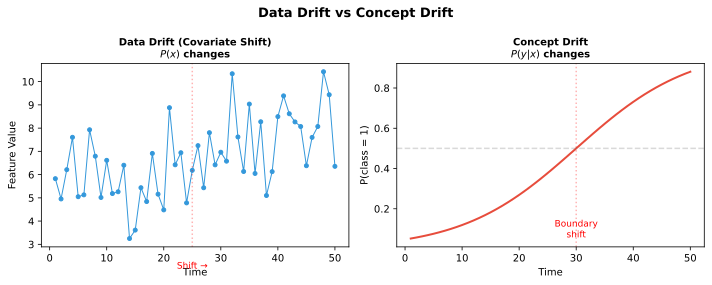

- **Data drift (covariate shift):** Input distribution $P(x)$ changes (e.g., users change behavior seasonally)
- **Concept drift:** Relationship $P(y|x)$ changes (e.g., what constitutes "fraud" evolves)
- **Model drift:** Model predictions degrade because of data or concept drift (observed as performance drop)
- **Detection:**
  - Input: PSI (Population Stability Index), KS test, domain classifier
  - Output: Monitor prediction distribution, confidence scores
  - Performance: Track ground-truth labels when available (delayed)
- **Handling:**
  - Scheduled retraining (daily/weekly)
  - Drift-triggered retraining (alert when drift exceeds threshold)
  - Online learning / continuous training for fast-changing distributions

---

### What is a feature store and why is it used?

- **Feature store:** Centralized repository for feature definitions, computation, and serving; separates feature logic from model code

- **Benefits:**
  - **Consistency:** Same features for training and serving → eliminates training/serving skew
  - **Reuse:** Features shared across teams/models; don't recompute
  - **Point-in-time correctness:** Each training sample gets the feature value that would have been available at prediction time → prevents data leakage
  - **Online serving:** Low-latency feature retrieval via key-value store for real-time inference
- **Examples:** Feast, Tecton, Vertex AI Feature Store

---

### How do you monitor a model in production (model performance, data quality, system health)? What metrics and alerts?

- **Model performance:** Track prediction accuracy / business metric when ground truth arrives; may have delayed feedback (e.g., 30-day conversion window)
- **Data quality:** Missing feature rates, null values, out-of-range values, distribution shifts (PSI for each feature)
- **System health:** Latency percentiles (p50, p99), throughput, error rate, memory/CPU utilization
- **Alert thresholds:** Based on historical variability; alert on abrupt shifts (drift) or gradual degradation
- **Tools:** Prometheus + Grafana, Evidently AI, WhyLabs, MLflow

---

### How do you design a CI/CD pipeline for ML models? How do you version models and data?

- **Pipeline stages:**
  1. **Data validation:** Schema checks, anomaly detection, train/test split integrity
  2. **Training:** Automated training with hyperparameter tuning
  3. **Evaluation:** Compare candidate model against production baseline on offline metrics
  4. **Deployment:** Canary test → shadow deployment (run new model alongside production) → gradual rollout
  5. **Monitoring:** Track metrics post-deployment with auto-rollback if degradation detected
- **Versioning:**
  - **Code:** Git (merge request triggers pipeline)
  - **Model:** Model registry (MLflow Model Registry, DVC)
  - **Data:** Data versioning (DVC, LakeFS, S3 versioning)
- **Reproducibility:** Pin data + code + model versions together in a run record

---

### When would you retrain a model, and how do you automate retraining safely?

- **Retraining triggers:**
  - **Scheduled:** Periodic (daily/weekly/monthly) regardless of drift
  - **Drift-triggered:** Automated detection of data/concept drift initiates retraining
  - **Performance-triggered:** Model metrics fall below threshold
- **Safe automation:**
  - **Validation gates:** New model must pass offline metrics + canary/shadow test before promotion
  - **A/B test:** Compare new model against production for a percentage of traffic
  - **Rollback plan:** Previous model version is preserved and can be re-deployed instantly
- **Incremental retraining:** Update model with new data without full retraining (for production efficiency)

---

### Batch vs online (stream) inference — what are the trade-offs? Static vs dynamic deployment?

- **Batch inference:** Precompute predictions offline (e.g., nightly) → store in DB for fast lookup; high throughput, lower cost per prediction, but stale if data changes
- **Online (stream) inference:** Predict in real-time via API → fresh predictions, lower latency requirements ($<100$ms), higher operational complexity
- **When batch suffices:** Recommendations for daily newsletter, daily fraud scoring, periodic trend predictions
- **When online necessary:** Real-time fraud detection, autocomplete, CTR prediction
- **Static deployment:** Model is fixed between updates; simpler, reproducible but doesn't adapt
- **Dynamic deployment:** Model is continuously updated (online learning, streaming updates); adapts but harder to monitor and debug

---

### Explain data parallelism vs model parallelism (and tensor/pipeline parallelism). When is pure data parallelism insufficient?

- **Data parallelism:** Replicate model on $N$ devices, shard the batch across devices, sync gradients → scales with batch size, requires model to fit on one device
- **Model parallelism:** Split model layers across devices → each device computes a subset of layers; necessary when model exceeds single device memory
- **Tensor parallelism:** Split individual operations (e.g., matrix multiply) across devices → fine-grained, high communication cost
- **Pipeline parallelism:** Split model into stages on different devices; data flows through stages sequentially → reduces idle time vs naive model parallelism
- **When data parallelism is insufficient:**
  - Model won't fit on one GPU (e.g., 175B parameter LLM)
  - Batch size limited by memory (can't scale further)
  - Communication overhead of gradient sync becomes bottleneck

---

### How would you deploy a model on resource-constrained/edge devices? Explain model compression/quantization/distillation.

- **Quantization:** Reduce weight precision from FP32 to INT8/INT4 → ~4x memory reduction, faster inference; may lose 1–2% accuracy
- **Pruning:** Remove unimportant weights or entire neurons (structured pruning) → smaller model, faster on hardware
- **Knowledge distillation:** Train a smaller "student" model to mimic larger "teacher" model → student is much smaller while retaining most accuracy
- **Hardware-specific optimizations:** CoreML (Apple), TFLite (Android), ONNX Runtime, TensorRT (NVIDIA)
- **Latency/memory/accuracy trade-off:** More compression = smaller/faster model but higher accuracy loss
- **Edge deployment patterns:** Preload model on device, periodic updates from cloud, hybrid (light model on device + heavy model on cloud for difficult cases)

---

### Walk me through an ML project end-to-end — the problem, dataset, model choice, evaluation metrics, results, and challenges.

- **Frame:** Define the problem, metric, and baseline clearly

- **Data:** Describe data sources, labeling process, train/val/test split, data quality checks
- **Model:** Justify model choice (why XGBoost vs neural net vs baseline), describe feature engineering
- **Evaluation:** Offline metrics + online experiment design; show results with confidence intervals
- **Challenges & lessons:** What went wrong, unexpected findings, trade-offs made
- **Quantify impact:** $X\%$ improvement in metric, translated to $Y$ business impact

---

### Tell me about a model you shipped that failed or underperformed in production. How did you diagnose it and what changed?

- Use STAR format (Situation, Task, Action, Result)

- Describe the failure: What were the symptoms? (e.g., latency spike, accuracy drop, user complaints)
- **Diagnosis:** Monitoring data revealed training/serving skew, data drift, or a data pipeline bug
- **Fix:** Aligned preprocessing, retrained on corrected data, added monitoring alerts
- **Result:** Performance recovered, and you added safeguards to prevent recurrence

---

### Tell me about a time you explained a complex ML concept (or model limitations/trade-offs) to a non-technical stakeholder.

- Use an audience-appropriate analogy (e.g., "the model is like a doctor with limited experience")
- Convey limitations clearly: what the model can and cannot do, where it might fail
- Explain trade-offs: "We can make it more accurate but slower, or faster but slightly less accurate"
- Enable decision-making: help stakeholder choose between options with clear cost/benefit

---

### Describe a time you had to choose between model accuracy and latency/system performance (or cost). How did you decide?

- Quantify the trade-off: "A 10% accuracy gain requires a 3x larger model, increasing p99 latency from 50ms to 200ms"
- Identify hard constraints: latency SLA from product team (e.g., must respond within 100ms)
- Decision: Optimize within constraint, or negotiate the constraint with evidence
- Show business awareness: "We chose the simpler model and served 95% of requests in under 50ms while still beating our previous baseline"

---

### How do you handle an ambiguous ML problem where multiple stakeholders have different definitions of 'better'?

- Elicit and align on objectives: Interview each stakeholder to understand their definition of success
- Define a shared metric: Find a proxy or composite metric that captures multiple perspectives (e.g., weighted combination of accuracy, coverage, latency)
- Make trade-offs explicit: "Improving precision by 5% reduces recall by 10% — which matters more for this use case?"
- Iterate: Build a prototype, get feedback, and refine the metric / objective

---

## Behavioral & System Design Notes

### Behavioral (STAR stories)

Prepare 3–4 STAR stories:
- An end-to-end ML project (problem → data → model → deployment → results)
- A production failure you diagnosed and resolved
- A stakeholder communication example (explaining trade-offs to non-technical audience)
- Quantify metrics and be explicit about trade-offs and what you'd do differently

### System Design (general framework)

Always open by clarifying objective/metric, scale, latency, and data availability, then structure as:
1. Data / labels → 2. Features → 3. Model → 4. Training → 5. Offline + online eval → 6. Serving & scaling → 7. Monitoring, retraining, drift

Separate candidate generation from ranking for recommendation/search prompts.
